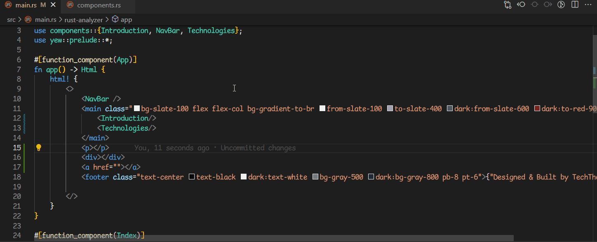

# code-html-macro-server

A fork of the [code-yew-server](https://github.com/ttax00/code-yew-server) extension that provides html language features for any html macro syntax in Rust in VS Code

## Features
- Syntax highlighting.
- HTML tags hover. 
- HTML completion suggestions.
- Document symbols.
- Symbols rename. 
- Folding ranges.

## Installation
Get the extension on [VSCode Marketplace](https://marketplace.visualstudio.com/items?itemName=brvnonascimento.code-html-macro-server) !

## Contributing
For those who are interested in getting involved:
 - Report bugs and request features by opening an issue [here](https://github.com/TechTheAwesome/code-yew-server/issues).
 - Contribute code or documentation by forking the repository and submitting a pull request [here](https://github.com/TechTheAwesome/code-yew-server/pulls).

### Unplanned / required help
Here's some long standing issues/feature that I would require assistance on if they were to be implemented.
- [ ] Formatting support.
- [ ] Language configuration crossing between rust & macro syntax. [Issue](https://github.com/TechTheAwesome/code-yew-server/issues/19)

## Acknowledgements
- Fork from [code-yew-server](https://github.com/ttax00/code-yew-server)
- Inspiration taken from [yew-highlighting](https://github.com/Alexandre-Borghi/yew-highlighting). 
- Follows the amazingly detailed guide for [embedded languages](https://code.visualstudio.com/api/language-extensions/embedded-languages).
